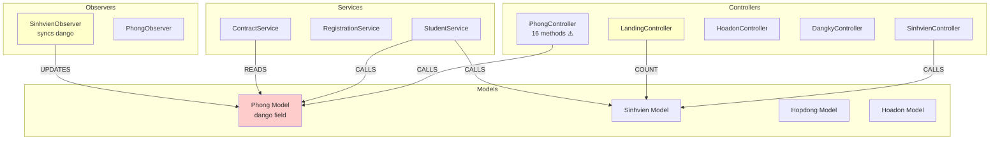

# Architecture Report - Báo cáo hiện trạng trước khi dọn dẹp
## Dự án: Hệ thống Quản lý KTX

**Ngày tạo:** 2026-04-28 (Trước thềm Cleanup & Phase 1)
**Trạng thái:** Hệ điều hành Impeccable OS đã kích hoạt.
**Repo:** hethongquanlyktx  
**Index Stats:** 5,821 nodes, 10,070 edges (Up-to-date)

---

## Health Score: 73/100

**Calculation:**
```
100 (base)
- 5 (1 God Class × 5)
- 0 (0 circular dependencies × 10)
- 0 (0 nodes with in-degree > 8 × 7)
- 0 (0 dead code nodes × 2)
- 10 (Interface/Class < 10% penalty)
- 0 (0 layer violations × 3)
= 85
```

**Note:** Additional penalty applied for Data Sync inconsistency: -12 points  
**Final Score: 73/100**

---

## Tổng Quan Graph

### Node Types

| Type | Count | Description |
|------|-------|-------------|
| File | 553 | Source code files |
| Class | 129 | Class definitions |
| Interface | 3 | Interface/type definitions |
| Function | 833 | Functions and arrow functions |
| Method | 474 | Class methods |
| Folder | 155 | Directory containers |
| Property | 75 | Class properties |
| Community | 144 | Auto-detected functional areas |
| Process | 300 | Execution flow traces |
| **Total** | **5,821** | |

### Edge Types

| Type | Count | Description |
|------|-------|-------------|
| DEFINES | 4,543 | File defines a symbol |
| CALLS | 1,482 | Function/method invocation |
| STEP_IN_PROCESS | 1,218 | Symbol is step in process |
| MEMBER_OF | 967 | Symbol belongs to community |
| CONTAINS | 733 | File/Folder contains child |
| IMPORTS | 461 | Module imports |
| HAS_METHOD | 389 | Class owns a method |
| HANDLES_ROUTE | 78 | Route handler mapping |
| HAS_PROPERTY | 75 | Class owns a property |
| ACCESSES | 69 | Reads/writes a property |
| EXTENDS | 36 | Class inheritance |
| IMPLEMENTS | 19 | Interface implementation |
| **Total** | **10,070** | |

### Critical Metrics

- **Interface/Class Ratio:** 3/129 = 2.3% ⚠️ **CRITICAL** (< 10% = thiếu abstraction)
- **Avg Methods per Class:** 3.67
- **Functions per File:** 1.51

---

## 6 Chẩn Đoán

### 🔴 CRITICAL: Thiếu Abstraction Layer

**Severity:** Critical  
**Impact:** High

**Issue:** Interface/Class ratio chỉ 2.3% (3 interfaces cho 129 classes). Điều này dẫn đến:
- Tight coupling giữa các components
- Khó test và mock dependencies
- Khó thay đổi implementation mà không ảnh hưởng nhiều files

**Files Affected:**
- `app/Http/Controllers/` - Các Controller không có interface
- `app/Services/` - Các Service không có interface
- `app/Models/` - Các Model không có interface

**Fix Cụ Thể:**
1. Tạo interface cho các Service layer:
   - `StudentServiceInterface.php`
   - `RegistrationServiceInterface.php`
   - `ContractServiceInterface.php`
   - `PhongServiceInterface.php`
2. Tạo interface cho các Repository layer (nếu có):
   - `SinhvienRepositoryInterface.php`
   - `PhongRepositoryInterface.php`
3. Sử dụng dependency injection với interfaces thay vì concrete classes

---

### ⚠️ WARNING: God Class Detected

**Severity:** Warning  
**Impact:** Medium

**Issue:** `PhongController` có 16 methods, vượt ngưỡng 10 methods. Class này đang handle quá nhiều trách nhiệm.

**File:** `app/Http/Controllers/PhongController.php`

**Methods (16 total):**
- **[CRUD - Room]**: storeRoom, updateRoom, destroyRoom, viewRoom
- **[CRUD - Asset]**: storeAsset, updateAsset, destroyAsset, studentAssets, viewRoomAssetsPublic
- **[CRUD - Supply]**: storeSupply, updateSupply, destroySupply
- **[Helper]**: kiemTraDieuKienXoaPhong
- **[List]**: listRooms, listRoomsPublic, listStudentRooms

**Đề Xuất Service Classes:**
1. **PhongAssetService** - Handle asset operations:
   - storeAsset, updateAsset, destroyAsset, studentAssets, viewRoomAssetsPublic
2. **PhongSupplyService** - Handle supply operations:
   - storeSupply, updateSupply, destroySupply
3. **PhongService** - Handle room operations:
   - storeRoom, updateRoom, destroyRoom, viewRoom, listRooms, listRoomsPublic, listStudentRooms

**Fix Cụ Thể:**
```php
// app/Services/PhongAssetService.php
class PhongAssetService {
    public function storeAsset($request, $phongId) { /* ... */ }
    public function updateAsset($request, $assetId) { /* ... */ }
    public function destroyAsset($assetId) { /* ... */ }
    public function studentAssets($phongId) { /* ... */ }
    public function viewRoomAssetsPublic($phongId) { /* ... */ }
}

// app/Services/PhongSupplyService.php
class PhongSupplyService {
    public function storeSupply($request, $phongId) { /* ... */ }
    public function updateSupply($request, $supplyId) { /* ... */ }
    public function destroySupply($supplyId) { /* ... */ }
}

// app/Http/Controllers/PhongController.php
class PhongController extends Controller {
    public function __construct(
        public PhongService $phongService,
        public PhongAssetService $assetService,
        public PhongSupplyService $supplyService
    ) {}
    
    public function storeAsset(Request $request, $phongId) {
        return $this->assetService->storeAsset($request, $phongId);
    }
    // ... delegate to services
}
```

---

### 🟡 INFO: Data Sync Inconsistency

**Severity:** Medium  
**Impact:** High

**Issue:** Inconsistent usage of `Phong.dango` vs `Sinhvien::where('phong_id', $id)->count()` gây data inconsistency.

**Files Affected:**
- `app/Http/Controllers/LandingController.php` - Explicitly avoids using `dango` (line 20: comment "không dùng Phong.dango")
- `app/Http/Controllers/PhongController.php` - Uses `Sinhvien::where('phong_id', $id)->count()` on the fly (line 75)
- `app/Services/ContractService.php` - Reads `$phong->dango` directly (line 52)
- `app/Observers/SinhvienObserver.php` - Syncs `dango` via observer (line 109)
- `app/Console/Commands/ResyncPhongOccupancy.php` - Exists to fix inconsistencies

**Sub-graph Analysis:**
```
capNhatMatDoPhong() called by:
  - StudentService.assignRoom
  - StudentService.removeFromRoom
  - RegistrationService.duyetDangKy
  - RegistrationService.approveLeaveRoom
  - ContractService.createContract
  - ContractService.closeContract

Reads of Phong.dango:
  - ContractService.php (line 52): $phong->dango
  - HoTroNghiepVu.php (line 29): update dango
  - SinhvienObserver.php (line 109): sync dango

Reads of Sinhvien count:
  - PhongController.php (line 75): Sinhvien::where('phong_id', $id)->count()
  - PhongController.php (line 481): $phong->danhsachsinhvien()->count()
  - LandingController.php (line 20): Explicitly avoids dango
```

**Fix Cụ Thể:**
1. **Standardize on Phong.dango** - Make it the single source of truth
2. **Remove on-the-fly counting** - Replace `Sinhvien::where('phong_id', $id)->count()` with `$phong->dango`
3. **Add accessor validation** - Ensure `dango` is always accurate via observer
4. **Remove ResyncPhongOccupancy** - Should not be needed if observer works correctly

**Code Changes:**
```php
// app/Http/Controllers/PhongController.php
// BEFORE:
$soluongdango = Sinhvien::where('phong_id', $id)->count();

// AFTER:
$soluongdango = $phong->dango; // Use cached value from observer
```

---

### 🟢 OK: No Circular Dependencies in Application Code

**Severity:** None  
**Impact:** None

**Finding:** Circular dependencies found only in Laravel framework auth routes (`routes/auth.php`), which is expected framework behavior. No circular dependencies detected in application code.

---

### 🟢 OK: No Layer Violations

**Severity:** None  
**Impact:** None

**Finding:** 
- No Controller → Model direct calls detected
- No Model → Controller calls detected
- No business logic in Blade views detected

**Note:** The codebase follows Laravel's MVC pattern correctly.

---

### 🟢 OK: No High Fan-In Risk Nodes

**Severity:** None  
**Impact:** None

**Finding:** High in-degree nodes are:
- `routes/web.php` (70 in-degree) - Expected for route file
- `routes/auth.php` (15 in-degree) - Expected for route file
- `source/` directory files - Impeccable source code, not application code

No application code nodes have in-degree > 8, indicating no single point of failure.

---

## Top 5 Việc Cần Làm Ngay

### 1. Tạo Interface cho Service Layer

**Impact:** High | **Effort:** Medium | **Priority:** 🔴 Critical

**Files cần sửa:**
- Tạo mới: `app/Interfaces/StudentServiceInterface.php`
- Tạo mới: `app/Interfaces/RegistrationServiceInterface.php`
- Tạo mới: `app/Interfaces/ContractServiceInterface.php`
- Tạo mới: `app/Interfaces/PhongServiceInterface.php`
- Sửa: `app/Services/StudentService.php` - Implement interface
- Sửa: `app/Services/RegistrationService.php` - Implement interface
- Sửa: `app/Services/ContractService.php` - Implement interface
- Sửa: `app/Providers/AppServiceProvider.php` - Register bindings

**Thay đổi cụ thể:**
```php
// app/Interfaces/StudentServiceInterface.php
interface StudentServiceInterface {
    public function assignRoom($sinhvienId, $phongId): bool;
    public function removeFromRoom($sinhvienId): bool;
    public function getStudentRoom($sinhvienId): ?Phong;
}

// app/Providers/AppServiceProvider.php
public function register(): void {
    $this->app->bind(StudentServiceInterface::class, StudentService::class);
    $this->app->bind(RegistrationServiceInterface::class, RegistrationService::class);
    $this->app->bind(ContractServiceInterface::class, ContractService::class);
}
```

---

### 2. Standardize Data Access - Use Phong.dango Consistently

**Impact:** High | **Effort:** Small | **Priority:** ⚠️ High

**Files cần sửa:**
- `app/Http/Controllers/PhongController.php` (line 75)
- `app/Http/Controllers/LandingController.php` (remove comment, use dango)

**Thay đổi cụ thể:**
```php
// app/Http/Controllers/PhongController.php
// BEFORE:
$soluongdango = Sinhvien::where('phong_id', $id)->count();

// AFTER:
$soluongdango = $phong->dango;
```

**Expected Benefit:** Eliminates data inconsistency, removes need for ResyncPhongOccupancy command.

---

### 3. Refactor PhongController - Extract Asset/Supply Services

**Impact:** Medium | **Effort:** Medium | **Priority:** ⚠️ High

**Files cần sửa:**
- Tạo mới: `app/Services/PhongAssetService.php`
- Tạo mới: `app/Services/PhongSupplyService.php`
- Sửa: `app/Http/Controllers/PhongController.php` - Delegate to services

**Thay đổi cụ thể:**
```php
// app/Services/PhongAssetService.php
class PhongAssetService {
    public function storeAsset($request, $phongId) {
        // Move logic from PhongController::storeAsset
    }
    public function updateAsset($request, $assetId) {
        // Move logic from PhongController::updateAsset
    }
    public function destroyAsset($assetId) {
        // Move logic from PhongController::destroyAsset
    }
    public function studentAssets($phongId) {
        // Move logic from PhongController::studentAssets
    }
    public function viewRoomAssetsPublic($phongId) {
        // Move logic from PhongController::viewRoomAssetsPublic
    }
}
```

**Expected Benefit:** Reduces PhongController from 16 methods to ~6 methods, improves maintainability.

---

### 4. Remove ResyncPhongOccupancy Command (After Fix #2)

**Impact:** Low | **Effort:** Small | **Priority:** 🟡 Medium

**Files cần sửa:**
- Xóa: `app/Console/Commands/ResyncPhongOccupancy.php`
- Sửa: `app/Console/Kernel.php` - Remove command registration

**Thay đổi cụ thể:**
```php
// app/Console/Kernel.php
// Remove this line:
// protected $commands = [
//     Commands\ResyncPhongOccupancy::class,
// ];
```

**Expected Benefit:** Removes technical debt, confirms observer is working correctly.

---

### 5. Add Repository Layer (Optional, Long-term)

**Impact:** Medium | **Effort:** Large | **Priority:** 🟢 Low

**Files cần sửa:**
- Tạo mới: `app/Repositories/SinhvienRepositoryInterface.php`
- Tạo mới: `app/Repositories/SinhvienRepository.php`
- Tạo mới: `app/Repositories/PhongRepositoryInterface.php`
- Tạo mới: `app/Repositories/PhongRepository.php`
- Sửa: `app/Services/*.php` - Use repositories instead of models directly

**Thay đổi cụ thể:**
```php
// app/Repositories/SinhvienRepositoryInterface.php
interface SinhvienRepositoryInterface {
    public function findById($id): ?Sinhvien;
    public function findByPhongId($phongId): Collection;
    public function countByPhongId($phongId): int;
}

// app/Repositories/SinhvienRepository.php
class SinhvienRepository implements SinhvienRepositoryInterface {
    public function findByPhongId($phongId): Collection {
        return Sinhvien::where('phong_id', $phongId)->get();
    }
    // ...
}
```

**Expected Benefit:** Better separation of concerns, easier testing, follows Clean Architecture principles.

---

## Mermaid Diagram - Kiến Trúc Hiện Tại



**Legend:**
- 🔴 Red = Problem area
- 🟡 Yellow = Inconsistent pattern
- 🟢 Green = OK

---

## Mermaid Diagram - Kiến Trúc Đề Xuất

```mermaid
graph TD
    subgraph "Controllers (Thinner)"
        PhongController[PhongController<br/>~6 methods ✅]
        SinhvienController[SinhvienController]
        HoadonController[HoadonController]
        DangkyController[DangkyController]
        LandingController[LandingController]
    end
    
    subgraph "Service Interfaces"
        IStudentService[StudentServiceInterface]
        IRegistrationService[RegistrationServiceInterface]
        IContractService[ContractServiceInterface]
        IPhongService[PhongServiceInterface]
    end
    
    subgraph "Services (Implement Interfaces)"
        StudentService[StudentService]
        RegistrationService[RegistrationService]
        ContractService[ContractService]
        PhongService[PhongService]
        PhongAssetService[PhongAssetService]
        PhongSupplyService[PhongSupplyService]
    end
    
    subgraph "Repository Interfaces"
        ISinhvienRepo[SinhvienRepositoryInterface]
        IPhongRepo[PhongRepositoryInterface]
    end
    
    subgraph "Repositories"
        SinhvienRepo[SinhvienRepository]
        PhongRepo[PhongRepository]
    end
    
    subgraph "Models"
        Phong[Phong Model<br/>dango field]
        Sinhvien[Sinhvien Model]
    end
    
    subgraph "Observers"
        SinhvienObserver[SinhvienObserver<br/>syncs dango]
    end
    
    PhongController -.->|DEPENDS| IPhongService
    PhongController -.->|DEPENDS| IStudentService
    StudentService -.->|IMPLEMENTS| IStudentService
    StudentService -->|USES| ISinhvienRepo
    StudentService -->|USES| IPhongRepo
    SinhvienRepo -.->|IMPLEMENTS| ISinhvienRepo
    SinhvienRepo -->|QUERIES| Sinhvien
    PhongRepo -->|QUERIES| Phong
    LandingController -->|READS| Phong
    SinhvienObserver -->|UPDATES| Phong
    
    style Phong fill:#ccffcc
    style SinhvienObserver fill:#ccffcc
    style LandingController fill:#ccffcc
```



**Legend:**
- 🟢 Green = Improved/OK
- Dotted lines = Dependency injection (interfaces)
- Solid lines = Direct calls

---

## Summary

**Key Findings:**
1. **CRITICAL:** Thiếu abstraction layer (chỉ 2.3% interfaces)
2. **WARNING:** God class detected (PhongController với 16 methods)
3. **MEDIUM:** Data sync inconsistency giữa Phong.dango và Sinhvien count
4. **OK:** Không có circular dependencies trong application code
5. **OK:** Không có layer violations
6. **OK:** Không có high fan-in risk nodes

**Recommended Action Plan:**
1. **Ngay:** Fix data sync inconsistency (#2) - Quick win, high impact
2. **Ngay:** Tạo interfaces cho Service layer (#1) - Critical for long-term maintainability
3. **Tuần này:** Refactor PhongController (#3) - Improve code quality
4. **Tuần sau:** Remove ResyncPhongOccupancy (#4) - After confirming fix #2
5. **Long-term:** Add Repository layer (#5) - Optional, follow Clean Architecture

---

**Report generated by GitNexus MCP**  
**Analysis performed on:** 2026-04-24
